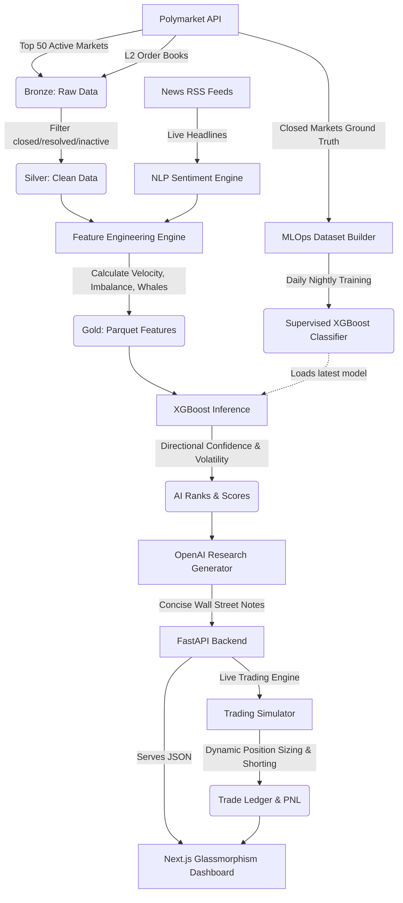

# 🔮 Polymarket Intelligence Lab


**Polymarket Intelligence Lab** is an institutional-grade, fully automated AI engine and Web Dashboard designed to extract, analyze, and predict directional opportunities in [Polymarket](https://polymarket.com/) (the world's largest decentralized prediction market).

Built for quantitative analysis, this engine goes beyond simple volume tracking. It peeks into the **L2 Order Books** to hunt whales, analyzes **live news sentiment** using NLP, and employs an **MLOps Self-Learning Loop** to continuously train a supervised directional model (Predicting if an option will resolve to YES or NO).

---

## 🏗 System Architecture (The "Brain")



---

## 🚀 Key Features

### 1. 🤖 Directional Machine Learning (BUY YES / BUY NO)
The core of the intelligence is a supervised **XGBoost Classifier**. 
- It evaluates the mathematical "hotness" of a market using Volume Anomalies and Velocity.
- It then calculates a **Directional Confidence** probability. 
- If the model is confident an event will happen, it flags `🟢 BUY YES`. If it's confident it will fail, it flags `🔴 BUY NO`.

### 2. 🐋 Beast Mode: L2 Order Book & Whale Detection
Unlike basic bots, this engine connects directly to the **CLOB (Central Limit Order Book)** API.
- **Bid/Ask Spread Imbalances**: Detects hidden buying/selling pressure.
- **Whale Wall Detection**: Scans the market depth for colossal, hidden limit orders (Spoofing/Iceberg detection).

### 3. 📉 Automated Backtesting & Trading Simulator
Includes a built-in virtual portfolio ($3,000) running continuously in the background via FastAPI.
- **Dynamic Position Sizing**: Invests $50 to $100 depending on the AI's confidence.
- **Shorting**: Automatically buys "NO" tokens if the AI predicts the market will resolve to NO.
- **Strict Risk Management**: Sells automatically at +30% (Take Profit) or -20% (Stop Loss).

### 4. 🔄 MLOps Self-Learning Loop
The true magic of the engine. Every night at 03:00 AM, the system:
1. Connects to Polymarket to fetch the day's **Closed Markets** (Ground Truth).
2. Merges this reality with its historical Parquet features.
3. **Re-trains** its Supervised XGBoost model automatically.
4. Logs the new "brain" to **MLflow**.
The system continuously learns from its mistakes and adapts to new market meta without human intervention.

### 5. ✨ Premium Web Dashboard
A stunning, institutional-grade web terminal built with Next.js, React, and Recharts.
- Real-time Leaderboard of the Top 50 AI Opportunities.
- Glassmorphism design, interactive modals, and L2 Order Book visualizations.
- Live Equity Curve and Trade Ledger.

---

## 🛠 Tech Stack

- **Data Engineering**: Python, Pandas, PyArrow (Parquet Data Lake).
- **Machine Learning**: Scikit-Learn, XGBoost, SHAP.
- **NLP**: NLTK (VADER), Feedparser.
- **Backend**: FastAPI, Uvicorn.
- **Frontend**: Next.js, React, Recharts, Lucide Icons, Vanilla CSS.
- **MLOps**: MLflow.
- **Package Management**: Poetry.

---

## ⚙️ How to Deploy (Auto-Pilot VPS)

This project is designed to be deployed on a Linux VPS (e.g., Ubuntu on Contabo, DigitalOcean, AWS) and run 24/7 autonomously via Cron jobs.

### 1. Clone the Repository
```bash
git clone https://github.com/YOUR_USERNAME/PolymarketIntelligenceLab-.git
cd PolymarketIntelligenceLab-
```

### 2. Setup the API & AI Keys
Create a `.env` file in the root directory:
```env
OPENAI_API_KEY="sk-tu-clave-aqui"
```

### 3. Install Dependencies (Poetry & Node)
```bash
# Python backend
curl -sSL https://install.python-poetry.org | python3 -
~/.local/bin/poetry install

# Frontend Next.js
cd frontend
npm install
npm run build
cd ..
```

### 4. Launch the Dashboard
We provide a convenient bash script that uses `tmux` to keep the FastAPI backend and Next.js frontend running forever:
```bash
bash ./scripts/start_dashboard.sh
```
Visit `http://YOUR_SERVER_IP:3000`

### 5. Setup the AI Cron Jobs (Automation)
The engine generates data silently in the background. Open your crontab:
```bash
crontab -e
```
Add the following lines to automate the Ingestion, Feature Engineering, Models, and the Nightly MLOps Loop:

```text
# 1. Hourly Data Ingestion (Top 50 + L2 Order Books)
0 * * * * cd /home/YOUR_USER/PolymarketIntelligenceLab- && ~/.local/bin/poetry run python -m src.ingestion.run_ingestion >> /tmp/polymarket_ingestion.log 2>&1

# 2. Hourly Feature Engineering & NLP Sentiment
5 * * * * cd /home/YOUR_USER/PolymarketIntelligenceLab- && ~/.local/bin/poetry run python -m src.features.run_features >> /tmp/polymarket_features.log 2>&1

# 3. Hourly AI Inference & ML Ranking
10 * * * * cd /home/YOUR_USER/PolymarketIntelligenceLab- && ~/.local/bin/poetry run python -m src.models.run_models >> /tmp/polymarket_models.log 2>&1

# 4. Nightly MLOps Self-Learning Loop (03:00 AM)
0 3 * * * cd /home/YOUR_USER/PolymarketIntelligenceLab- && ./scripts/run_mlops.sh >> /tmp/polymarket_mlops.log 2>&1
```

---

## 📊 Directory Structure
Everything the engine generates is stored locally and securely in your server:
- `data/raw/` (Bronze)
- `data/processed/` (Silver/Gold)
- `data/models/` (AI Inference Outputs & SQLite Ledger)
- `mlruns/` (MLflow Registry)
- `src/` (Python Engine)
- `frontend/` (Next.js Application)

## 📝 License
[MIT](https://choosealicense.com/licenses/mit/)